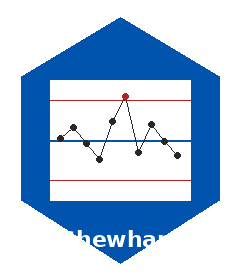
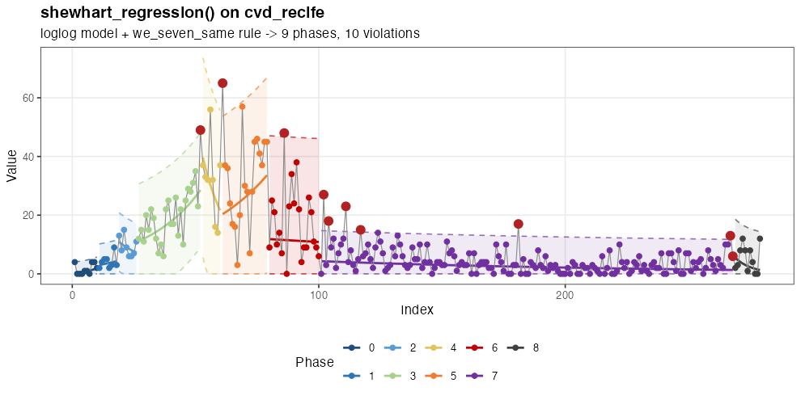
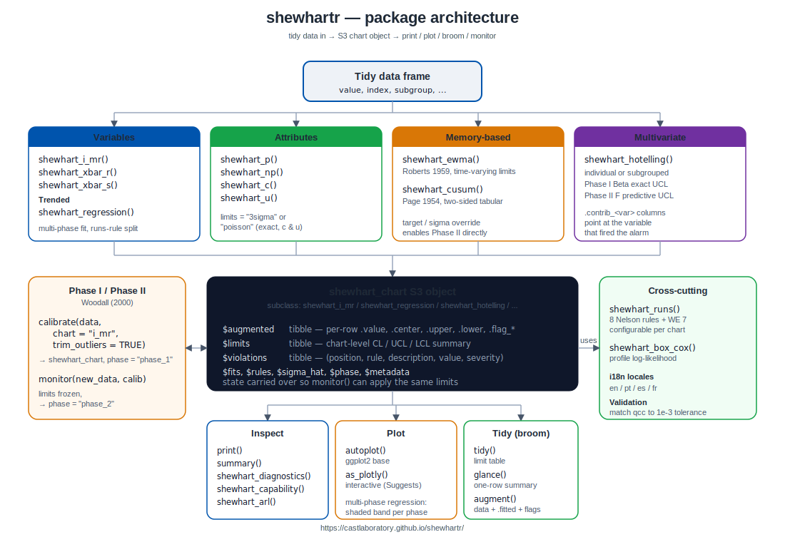

```{r setup, include = FALSE}
knitr::opts_chunk$set(
  collapse = TRUE,
  comment  = "#>",
  fig.path = "man/figures/README-",
  out.width = "100%"
)
```

# shewhartr <a href="https://castlaboratory.github.io/shewhartr/"></a>

<!-- badges: start -->
[](https://github.com/castlaboratory/shewhartr/actions/workflows/R-CMD-check.yaml)
[](https://app.codecov.io/gh/castlaboratory/shewhartr)
[](https://lifecycle.r-lib.org/articles/stages.html#experimental)
<!-- badges: end -->

`shewhartr` is a tidyverse-native toolkit for Statistical Process Control
(SPC). It implements the classical Shewhart chart family — variables
(I-MR, Xbar-R, Xbar-S) and attributes (p, np, c, u) — alongside a
flagship **regression-based control chart** for processes with trend,
where stationarity is too strong an assumption to make.

The package is built around a small set of design choices:

- **Tidy by default.** Every constructor takes `data` first, supports
  tidy-eval column references, and returns an S3 object that integrates
  with [broom](https://broom.tidymodels.org/) via `tidy()`, `glance()`
  and `augment()`.
- **Diagnostics in the box.** Average Run Length (ARL) by Monte Carlo
  simulation, all eight Nelson runs rules, Box-Cox guidance, and a
  Tukey-style residual panel are first-class citizens.
- **Phase I / Phase II.** Explicit `calibrate()` and `monitor()`
  functions make the distinction between estimation and prospective
  monitoring impossible to confuse, following Woodall (2000).
- **Multilingual plots.** Pass `locale = "pt"` (or `"es"`, `"fr"`)
  and chart titles, axis labels, and legends are translated.
- **Statistically honest counts.** c and u charts accept
  `limits = "poisson"` for exact Poisson quantile limits, instead of
  the normal approximation that breaks down at small means.

## Installation

```{r, eval = FALSE}
# Development version
remotes::install_github("castlaboratory/shewhartr")
```

## A 30-second tour

```{r example, eval = FALSE}
library(shewhartr)
library(ggplot2)

# Classical I-MR chart on a 100-observation series with a small drift
fit <- shewhart_i_mr(bottle_fill, value = ml, index = observation)

print(fit)
autoplot(fit)
```

## When to use which chart

| Data type                                    | Chart                                                                            |
|----------------------------------------------|----------------------------------------------------------------------------------|
| Individual measurements (no rational subgroup) | [`shewhart_i_mr()`](https://castlaboratory.github.io/shewhartr/reference/shewhart_i_mr.html)        |
| Subgroups of size 2-10                       | [`shewhart_xbar_r()`](https://castlaboratory.github.io/shewhartr/reference/shewhart_xbar_r.html)    |
| Subgroups of size > 10 or unequal n          | [`shewhart_xbar_s()`](https://castlaboratory.github.io/shewhartr/reference/shewhart_xbar_s.html)    |
| Proportion of nonconforming                  | [`shewhart_p()`](https://castlaboratory.github.io/shewhartr/reference/shewhart_p.html)              |
| Number of nonconforming, constant n          | [`shewhart_np()`](https://castlaboratory.github.io/shewhartr/reference/shewhart_np.html)            |
| Defect counts, constant inspection size      | [`shewhart_c()`](https://castlaboratory.github.io/shewhartr/reference/shewhart_c.html)              |
| Defect counts, variable inspection size      | [`shewhart_u()`](https://castlaboratory.github.io/shewhartr/reference/shewhart_u.html)              |
| Process with trend (drift, growth, decay)    | [`shewhart_regression()`](https://castlaboratory.github.io/shewhartr/reference/shewhart_regression.html) |
| Small persistent shifts (memory-based)       | [`shewhart_ewma()`](https://castlaboratory.github.io/shewhartr/reference/shewhart_ewma.html), [`shewhart_cusum()`](https://castlaboratory.github.io/shewhartr/reference/shewhart_cusum.html) |
| Several correlated variables monitored jointly | [`shewhart_hotelling()`](https://castlaboratory.github.io/shewhartr/reference/shewhart_hotelling.html) |

## Multi-phase regression chart

The flagship chart for trended processes splits the series into
phases when a runs rule fires, fits a local model in each, and
flags points that depart from the local trend. The example below
uses the COVID-19 mortality series for Recife (`cvd_recife`) with
the original analysis settings from Ferraz et al. (2020):

```{r, eval = FALSE}
fit <- shewhart_regression(
  cvd_recife,
  value       = new_deaths,
  index       = .t,
  model       = "loglog",
  phase_rule  = "we_seven_same",
  rules       = c("nelson_1_beyond_3s", "we_seven_same"),
  lower_bound = 0
)

length(fit$fits)              # number of phases detected
nrow(fit$violations)          # individual flagged observations
autoplot(fit)
```



Each shaded band is one phase, the solid line is the local
regression centre, the dashed lines are the phase's 3-sigma limits,
and the firebrick points are the days flagged by the rule set as
departing from the local trend.

## Phase I vs Phase II

A Shewhart chart serves two different purposes that are easy to
conflate. **Phase I** is retrospective: take historical data, identify
out-of-control points, eliminate assignable causes, and arrive at
trustworthy estimates of the process mean and variability. **Phase II**
is prospective: take those estimated limits and apply them to new
data, signalling alarms when something departs from the established
baseline. The package draws this line in code:

```{r, eval = FALSE}
# Phase I: estimate limits from a clean baseline
calib <- calibrate(historical_data, value = y,
                   chart = "i_mr", trim_outliers = TRUE)

# Phase II: apply the limits to new data
alarms <- monitor(new_observations, calib)
alarms$violations
```

## Architecture



Every chart constructor — variables (`shewhart_i_mr`, `shewhart_xbar_r`,
`shewhart_xbar_s`), attributes (`shewhart_p`, `shewhart_np`,
`shewhart_c`, `shewhart_u`), regression
(`shewhart_regression`), memory-based (`shewhart_ewma`,
`shewhart_cusum`), and multivariate (`shewhart_hotelling`) —
returns a `shewhart_chart` S3 object with a uniform layout. The same
object then feeds into:

- **Inspect**: `print()`, `summary()`, `shewhart_diagnostics()`,
  `shewhart_capability()`, `shewhart_arl()`.
- **Plot**: `autoplot()` (ggplot2) and `as_plotly()` (interactive,
  `plotly` in `Suggests`).
- **Tidy**: `broom::tidy()`, `glance()`, `augment()`.
- **Phase II**: `calibrate()` produces a Phase I chart whose limits
  are frozen by `monitor()` for prospective monitoring.

## Documentation

The [website](https://castlaboratory.github.io/shewhartr/) hosts:

- A full reference for every exported function.
- Topical articles: [variables charts](https://castlaboratory.github.io/shewhartr/articles/variables-charts.html),
  [attributes charts](https://castlaboratory.github.io/shewhartr/articles/attributes-charts.html),
  [regression charts](https://castlaboratory.github.io/shewhartr/articles/regression-charts.html),
  [Phase I/II](https://castlaboratory.github.io/shewhartr/articles/phase1-phase2.html),
  [ARL by simulation](https://castlaboratory.github.io/shewhartr/articles/arl-simulation.html),
  [residual diagnostics](https://castlaboratory.github.io/shewhartr/articles/diagnostics.html),
  [Box-Cox guidance](https://castlaboratory.github.io/shewhartr/articles/box-cox.html).
- A case study on epidemiological monitoring with the regression chart.

## Citation

If you use `shewhartr` in academic work, please cite:

> Leite, A., Vasconcelos, H., Ospina, R., & Ferraz, C. (2025). *shewhartr: Statistical
> Process Control with Tidyverse-Native Workflows*. R package version
> 1.0.0. https://castlaboratory.github.io/shewhartr/

## References

- Shewhart, W. A. (1931). *Economic Control of Quality of Manufactured
  Product*. D. Van Nostrand.
- Montgomery, D. C. (2019). *Introduction to Statistical Quality
  Control* (8th ed.). Wiley.
- Nelson, L. S. (1984). The Shewhart Control Chart — Tests for
  Special Causes. *Journal of Quality Technology*, 16(4), 237-239.
- Woodall, W. H. (2000). Controversies and Contradictions in
  Statistical Process Control. *Journal of Quality Technology*,
  32(4), 341-350.
- Box, G. E. P., & Cox, D. R. (1964). An Analysis of Transformations.
  *Journal of the Royal Statistical Society B*, 26(2), 211-252.
- Tukey, J. W. (1977). *Exploratory Data Analysis*. Addison-Wesley.
- Wheeler, D. J., & Chambers, D. S. (1992). *Understanding Statistical
  Process Control* (2nd ed.). SPC Press.
