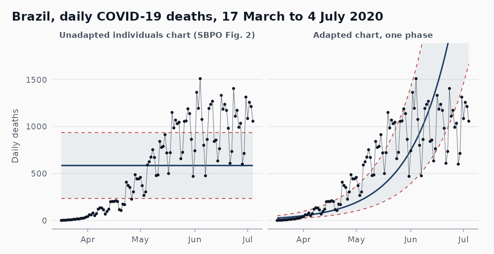
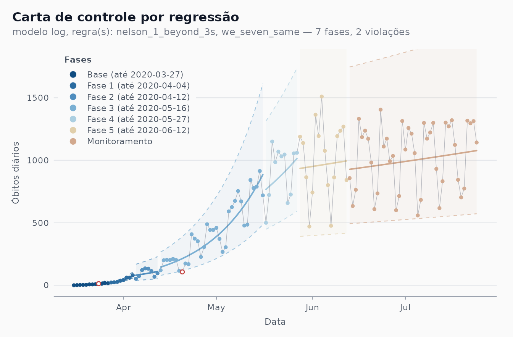
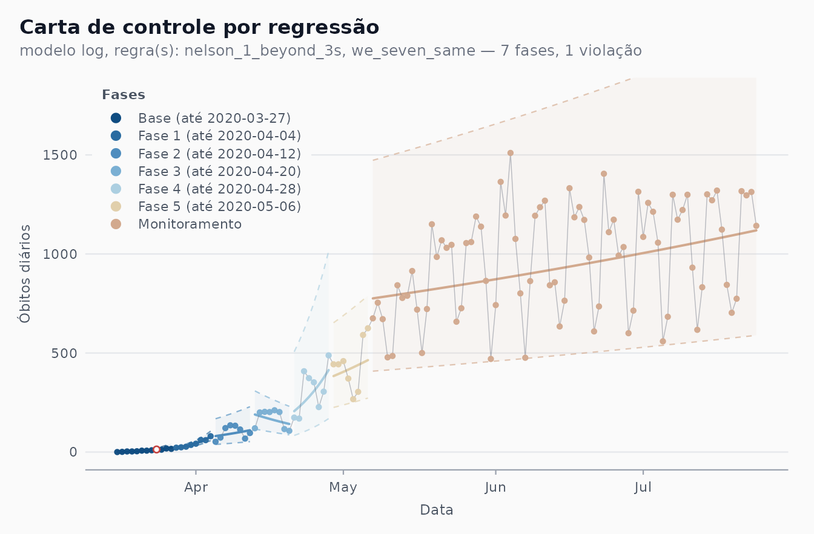
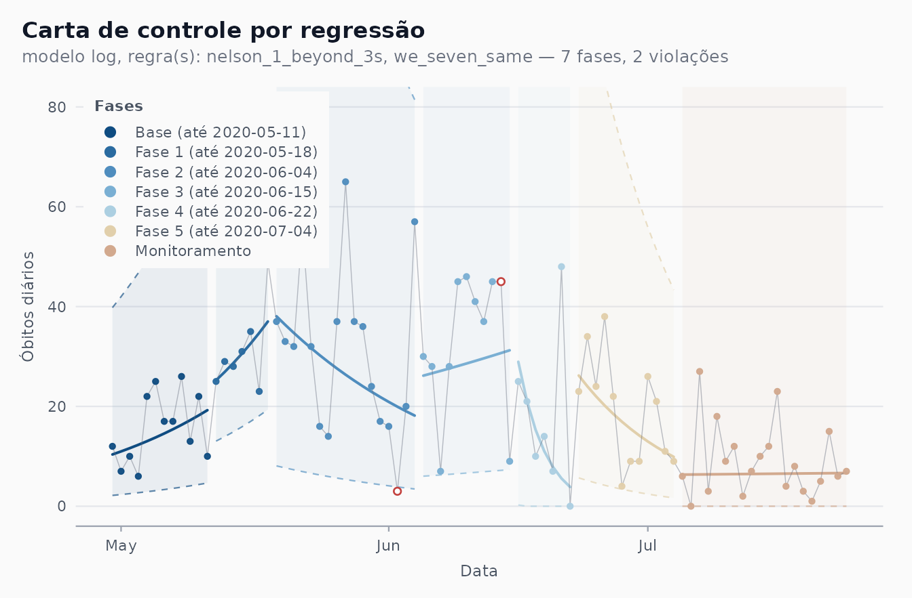
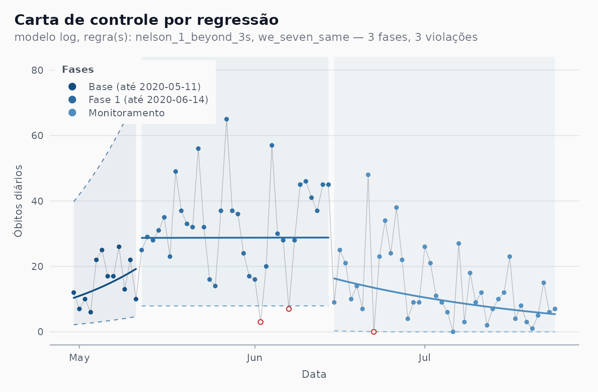
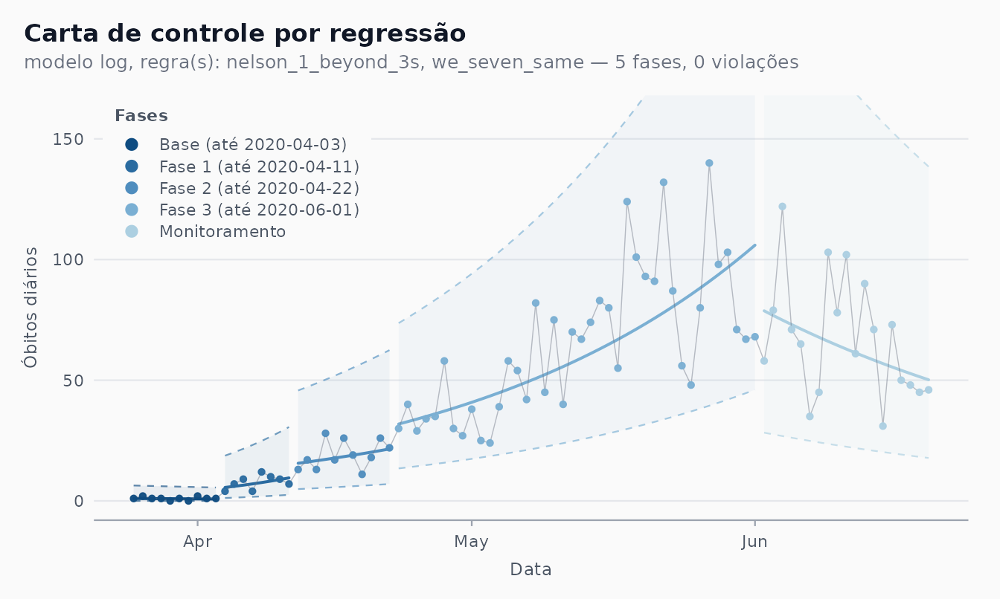
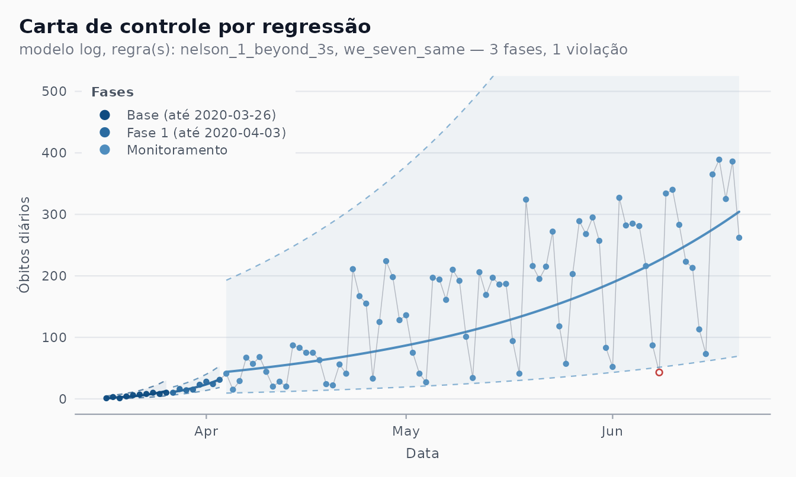
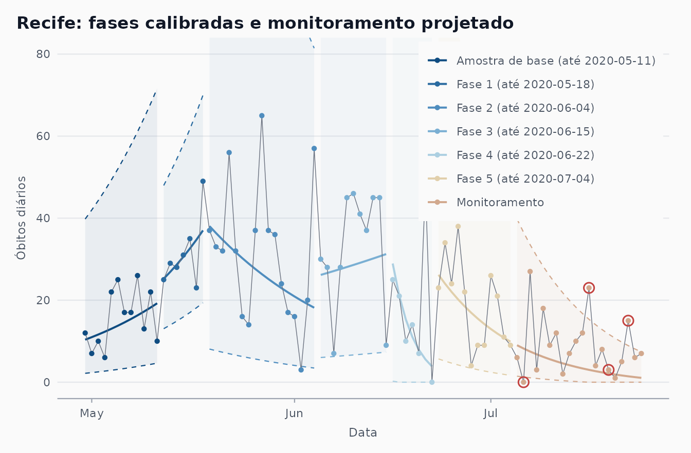

# Reproducing the charts of Ferraz et al. (2020)

``` r

library(shewhartr)
library(ggplot2)
library(dplyr)
```

This article rebuilds, with `shewhartr`, the Shewhart charts of the two
2020 papers in which the Castlab team proposed the adapted chart for
COVID-19 mortality. It closes [issue
\#2](https://github.com/castlaboratory/shewhartr/issues/2). The
companion article
[`vignette("prospective-replay")`](https://castlaboratory.github.io/shewhartr/articles/prospective-replay.md)
takes up the “simulation” of those papers (issue \#3).

## 1. The two articles

**SBPO 2020.** Ferraz, C., Petenate, A. J., Leite Wanderley, A., Ospina,
R., Torres, J. E. M., & Peruzzi Moreira, A. (2020). Gráficos de Shewhart
para monitoramento de COVID-19 na cidade de Recife. In *Anais do LII
Simpósio Brasileiro de Pesquisa Operacional* (SBPO 2020), João
Pessoa-PB, 3-5 November 2020. A short conference paper with five
figures: a generic chart (Fig. 1), the unadapted individuals chart on
Brazil’s daily deaths (Fig. 2), the adapted chart for Brazil (Fig. 3),
the adapted chart for Recife’s daily deaths (Fig. 4) and one for
Recife’s notifications of severe acute respiratory syndrome, SRAG (Fig.
5). Figures 3 and 4 “simulate prospective monitoring” with the
seven-point shift rule as the only criterion for a new phase; Fig. 5
uses phases chosen by the team’s experts.

**RBE 2020.** Ferraz, C., Petenate, A. J., Wanderley, A. L., Ospina, R.,
Torres, J., & Peruzzi Moreira, A. (2020). COVID-19: monitoramento por
gráficos de Shewhart. *Revista Brasileira de Estatística*, 78(245),
23-41. The journal version: it states the adaptation as an algorithm
(section 4, steps i-v), fixes the base at the first 10 days, uses
Ministry of Health data up to 20 June 2020 and shows Brazil (Fig. 6),
Pernambuco (Fig. 7) and São Paulo (Fig. 8). Both papers build on the
hybrid chart of Perla et al. (2020).

## 2. The adapted chart in package terms

The algorithm of the RBE paper, step by step, and the argument of
[`shewhart_regression()`](https://castlaboratory.github.io/shewhartr/reference/shewhart_regression.md)
that implements it:

| Article (RBE, section 4) | [`shewhart_regression()`](https://castlaboratory.github.io/shewhartr/reference/shewhart_regression.md) |
|----|----|
| i\. Fit $`\log_{10}(1 + y_t) = \beta_0 + \beta_1 t + \varepsilon_t`$ by least squares, one fit per phase | `model = "log"`: `log(1 + y) ~ .N`, with `.N` the day within the phase. The base of the logarithm cancels in steps iii-v, so natural logs give the same chart |
| ii\. Residuals $`\hat\varepsilon_t`$ of that fit | computed on the log scale: `.model_value - .model_center` |
| iii\. Individuals chart on the residuals: $`LS = \bar{\hat\varepsilon} + 3\,\overline{MR}/1.128`$ | `limits_scale = "model"` with the default `sigma_method = "mr"`; $`\bar{\hat\varepsilon} = 0`$ for a least-squares fit with an intercept |
| iv\. Fitted line $`\pm LS`$ | `limits_scale = "model"` builds the band on the log scale |
| v\. Back-transform the centre line and limits | done by `limits_scale = "model"`; `lower_bound = 0` keeps the lower limit at zero |
| First 10 days as the base | `start_base = 10` (automatic detection) |
| New phase after 7 consecutive points on one side of the centre line | `phase_rule = "we_seven_same"`, flagged with `rules = c("nelson_1_beyond_3s", "we_seven_same")` |
| Phases picked by clicking dates on the web platform | `phase_changes = <dates>` (the first day of each new phase) |
| Last phase projected forward (“Monitoramento”) | [`calibrate()`](https://castlaboratory.github.io/shewhartr/reference/calibrate.md) up to the last phase, then [`monitor()`](https://castlaboratory.github.io/shewhartr/reference/monitor.md) (section 7) |
| Portuguese legend with the end date of every phase | `locale = "pt"`, `autoplot(phase_dates = TRUE, legend_position = "inside")` |

Two small helpers are used throughout: the first day of every phase, and
the axis titles of the articles.

``` r

phase_starts <- function(fit) {
  a <- fit$augmented
  a[[fit$metadata$index_name]][!duplicated(a$.phase)][-1]
}
article_axes <- labs(x = "Data", y = "\u00d3bitos di\u00e1rios")
```

## 3. Why the chart has to be adapted (SBPO Fig. 2)

SBPO Fig. 2 applies the textbook individuals chart to Brazil’s daily
deaths from the first death, 17 March 2020, over about 110 days: a
constant centre line at Avg = 584.23 with UCL = 932.78 and LCL = 235.67.
The same window in `cvd_brazil` (17 March to 4 July, 110 days) gives
almost the same numbers; the small gap is the data vintage (section 8).

``` r

br_naive <- subset(cvd_brazil, region == "BR" &
                     date >= as.Date("2020-03-17") &
                     date <= as.Date("2020-07-04"))
fit_naive <- shewhart_i_mr(br_naive, value = new_deaths, index = date)
fit_naive$augmented |>
  slice(1) |>
  select(.center, .upper, .lower)
#> # A tibble: 1 × 3
#>   .center .upper .lower
#>     <dbl>  <dbl>  <dbl>
#> 1    585.   936.   235.
```

All 31 points of the first month sit below the LCL and 19 of the last 30
above the UCL: the chart reports that an epidemic grows, which nobody
needed a chart for. The adapted chart on the same 110 days (a single
phase, `phase_changes = integer(0)`) follows the trend instead. The two
are drawn on one scale below.

``` r

fit_one <- shewhart_regression(br_naive, value = new_deaths, index = date,
                               model = "log", limits_scale = "model",
                               lower_bound = 0,
                               phase_changes = integer(0))
both <- bind_rows(
  fit_naive$augmented |>
    transmute(date, .value, .center, .upper, .lower,
              panel = "Unadapted individuals chart (SBPO Fig. 2)"),
  fit_one$augmented |>
    transmute(date, .value, .center, .upper, .lower,
              panel = "Adapted chart, one phase")
)
both$panel <- factor(both$panel, levels = unique(both$panel))
sig <- shewhart_palette("signal")
ink <- shewhart_palette("neutral")
ggplot(both, aes(date)) +
  geom_ribbon(aes(ymin = .lower, ymax = .upper),
              fill = sig["in_control"], alpha = 0.07) +
  geom_line(aes(y = .upper), colour = sig["out_of_control"],
            linetype = "dashed", linewidth = 0.4) +
  geom_line(aes(y = .lower), colour = sig["out_of_control"],
            linetype = "dashed", linewidth = 0.4) +
  geom_line(aes(y = .center), colour = sig["in_control"], linewidth = 0.7) +
  geom_line(aes(y = .value), colour = ink["text_low"], linewidth = 0.25) +
  geom_point(aes(y = .value), colour = ink["text_high"], size = 0.8) +
  facet_wrap(~panel) +
  coord_cartesian(ylim = c(0, 1800)) +
  labs(x = NULL, y = "Daily deaths",
       title = "Brazil, daily COVID-19 deaths, 17 March to 4 July 2020") +
  shewhart_theme()
```



A single log-linear phase is still too crude for 110 days of an epidemic
(the growth slowed in May), which is why the articles cut the series
into phases.

## 4. Brazil (SBPO Fig. 3, RBE Fig. 6)

### Retrospective reconstruction with the article’s phases

SBPO Fig. 3 covers 16 March to 24 July 2020. Its legend reads “Amostra
de base (até 2020-03-27)”, then phases ending on 03-27, 04-04, 04-12,
05-16, 05-27 and 06-12, then “Monitoramento”. The first of those phases
ends on the same day as the base, so it holds no data (an artefact of
the web platform on which the phases were clicked). Five real phases
remain; `phase_changes` takes the day after each end date. Our “Fase 1”
to “Fase 5” are therefore the article’s “Fase 2” to “Fase 6”.

``` r

br <- subset(cvd_brazil, region == "BR" &
               date >= as.Date("2020-03-16") & date <= as.Date("2020-07-24"))
br_ends <- as.Date(c("2020-03-27", "2020-04-04", "2020-04-12",
                     "2020-05-16", "2020-05-27", "2020-06-12"))
fit_br <- shewhart_regression(
  br, value = new_deaths, index = date,
  model = "log", limits_scale = "model", lower_bound = 0,
  phase_changes = br_ends + 1,
  rules  = c("nelson_1_beyond_3s", "we_seven_same"),
  locale = "pt"
)
unique(fit_br$augmented$.phase_label)
#> [1] "Base (até 2020-03-27)"   "Fase 1 (até 2020-04-04)"
#> [3] "Fase 2 (até 2020-04-12)" "Fase 3 (até 2020-05-16)"
#> [5] "Fase 4 (até 2020-05-27)" "Fase 5 (até 2020-06-12)"
#> [7] "Monitoramento"
autoplot(fit_br, phase_dates = TRUE, legend_position = "inside") +
  coord_cartesian(ylim = c(0, 1800)) +
  article_axes
```



The reconstruction shows what the article describes: exponential growth
until mid-May, then a much flatter log-linear trend that is still rising
at the end of July, with the day-to-day swings (the weekly reporting
cycle) inside the limits. The bands are wide and asymmetric because they
are $`\pm 3\sigma`$ on the $`\log(1 + y)`$ scale, carried back with the
exponential.

### Automatic detection

`phase_rule = "we_seven_same"` looks for the same seven-point runs
without being told the dates. The SBPO base is the first 12 days (16 to
27 March), so `start_base = 12`:

``` r

fit_br_auto <- shewhart_regression(
  br, value = new_deaths, index = date,
  model = "log", limits_scale = "model", lower_bound = 0,
  start_base = 12, phase_rule = "we_seven_same",
  rules  = c("nelson_1_beyond_3s", "we_seven_same"),
  locale = "pt"
)
autoplot(fit_br_auto, legend_position = "inside") +
  coord_cartesian(ylim = c(0, 1800)) +
  article_axes
```



``` r

n_max <- max(length(br_ends), length(phase_starts(fit_br_auto)))
knitr::kable(data.frame(
  phase = seq_len(n_max),
  article = format(c(br_ends + 1, rep(NA, n_max - length(br_ends)))),
  automatic = format(c(phase_starts(fit_br_auto),
                       rep(NA, n_max - length(phase_starts(fit_br_auto)))))
), col.names = c("New phase", "Article (first day)", "phase_rule (first day)"))
```

| New phase | Article (first day) | phase_rule (first day) |
|----------:|:--------------------|:-----------------------|
|         1 | 2020-03-28          | 2020-03-28             |
|         2 | 2020-04-05          | 2020-04-05             |
|         3 | 2020-04-13          | 2020-04-13             |
|         4 | 2020-05-17          | 2020-04-21             |
|         5 | 2020-05-28          | 2020-04-29             |
|         6 | 2020-06-13          | 2020-05-07             |

The first cut is the end of the 12-day base. The next two, found by the
rule, are exactly the article’s (5 and 13 April). From there on the two
charts part: the rule keeps cutting April into 8-day pieces and opens
its last phase in early May, while the article has a long phase until 16
May and two more before its monitoring segment. Both agree that a
single, much flatter growth regime runs from May to the end of the
window. They differ for three reasons:

- **Data vintage.** The figure used the Ministry of Health bulletins of
  July 2020; `cvd_brazil` is a later compilation, and a revised day can
  move a run by one position.
- **Greedy refit.** `phase_rule` scans the most recent phase *after
  refitting it on every point up to the end of the data*. A long, curved
  stretch fitted by one straight line leaves its first points on one
  side, so the rule cuts it again as soon as a phase is long enough to
  be tested, which produces the regular 8-day phases of April. The
  article’s phases were placed by analysts looking at the data as they
  arrived.
- **Cut placement.** The package opens a phase on the first day after
  the run. The article’s own reading of the rule is the same (RBE: the
  new phase starts at “a primeira data após uma sequência de sete
  pontos”), but the phases drawn in the figures were also revised by the
  experts once more data had accumulated (SBPO, section 3). The 8-day
  phases of the article cannot come from a strictly prospective
  seven-point rule at all;
  [`vignette("prospective-replay")`](https://castlaboratory.github.io/shewhartr/articles/prospective-replay.md)
  shows why.

The RBE version of this chart (Fig. 6) stops on 20 June and uses a base
of 10 days from the first death. Its text says that Phase 1 begins on 4
May, after seven points above the centre line, and that five phases are
found:

``` r

br_rbe <- subset(cvd_brazil, region == "BR" &
                   date >= as.Date("2020-03-17") &
                   date <= as.Date("2020-06-20"))
fit_rbe <- shewhart_regression(
  br_rbe, value = new_deaths, index = date,
  model = "log", limits_scale = "model", lower_bound = 0,
  start_base = 10, phase_rule = "we_seven_same"
)
phase_starts(fit_rbe)
#> [1] "2020-03-27" "2020-04-04" "2020-04-12" "2020-04-20"
```

With today’s data the rule opens its phases in late March and April, not
on 4 May: we could not reproduce that date from the published series,
and the RBE figure itself is not reproduced here.

## 5. Recife (SBPO Fig. 4)

`cvd_recife` starts on 28 March; SBPO Fig. 4 shows 30 April to 24 July,
with the base up to 11 May, phases ending on 05-18, 06-04, 06-15, 06-22
and 07-04, and “Monitoramento” after that.

``` r

rec <- subset(cvd_recife, date >= as.Date("2020-04-30") &
                date <= as.Date("2020-07-24"))
rec_ends <- as.Date(c("2020-05-11", "2020-05-18", "2020-06-04",
                      "2020-06-15", "2020-06-22", "2020-07-04"))
fit_rec <- shewhart_regression(
  rec, value = new_deaths, index = date,
  model = "log", limits_scale = "model", lower_bound = 0,
  phase_changes = rec_ends + 1,
  rules  = c("nelson_1_beyond_3s", "we_seven_same"),
  locale = "pt"
)
unique(fit_rec$augmented$.phase_label)
#> [1] "Base (até 2020-05-11)"   "Fase 1 (até 2020-05-18)"
#> [3] "Fase 2 (até 2020-06-04)" "Fase 3 (até 2020-06-15)"
#> [5] "Fase 4 (até 2020-06-22)" "Fase 5 (até 2020-07-04)"
#> [7] "Monitoramento"
autoplot(fit_rec, phase_dates = TRUE, legend_position = "inside") +
  coord_cartesian(ylim = c(0, 80)) +
  article_axes
```



The legend matches the figure phase by phase. As in the article, the y
axis stops at 80 and some bands run off the panel: with a handful of
deaths a day, $`\log(1 + y)`$ turns every short or noisy phase into a
wide multiplicative band (Phase 4 has seven points, one of them a zero,
and its upper limit reaches several hundred). That is the data, not a
bug to be fixed.

The two readings of the SBPO paper are visible. Phase 2 (19 May to 4
June) has a falling centre line; it follows the lockdown decreed for
Recife and its metropolitan area from 16 to 31 May, whose effect on
deaths would only appear some days later. And from about 22 June the
centre line points down again: the last two segments describe the
decline that the article reported as the current situation.

The automatic detection, with the same 12-day base:

``` r

fit_rec_auto <- shewhart_regression(
  rec, value = new_deaths, index = date,
  model = "log", limits_scale = "model", lower_bound = 0,
  start_base = 12, phase_rule = "we_seven_same",
  rules  = c("nelson_1_beyond_3s", "we_seven_same"),
  locale = "pt"
)
phase_starts(fit_rec_auto)
#> [1] "2020-05-12" "2020-06-15"
autoplot(fit_rec_auto, legend_position = "inside") +
  coord_cartesian(ylim = c(0, 80)) +
  article_axes
```



The first cut is again the end of the base (12 May, the article’s Phase
1). The rule then finds one change, on 15 June, one day before the
article’s Phase 4, and does not split May and June into the article’s
shorter phases: with counts this small the log-scale noise is large, and
the article’s 7-day phases (Phases 1 and 4) are shorter than any run the
rule can detect inside a fitted phase. What remains is the overall
reading: a plateau from mid-May to mid-June, then a decline.

## 6. Pernambuco and São Paulo (RBE Figs. 7 and 8)

Automatic detection only, with the RBE settings (data to 20 June, base
of 10 days). Each series starts on its first day with a death, so the
base is not a run of zeros.

``` r

first_death <- function(d) d[seq(which(d$new_deaths > 0)[1], nrow(d)), ]
pe <- first_death(subset(cvd_brazil, region == "PE" &
                           date <= as.Date("2020-06-20")))
fit_pe <- shewhart_regression(
  pe, value = new_deaths, index = date,
  model = "log", limits_scale = "model", lower_bound = 0,
  start_base = 10, phase_rule = "we_seven_same",
  rules  = c("nelson_1_beyond_3s", "we_seven_same"),
  locale = "pt"
)
autoplot(fit_pe, legend_position = "inside") +
  coord_cartesian(ylim = c(0, 160)) +
  article_axes
```



Pernambuco: rising until mid-May and falling since, as the article says;
the last phase before the monitoring segment (Phase 3) spans the 16-31
May lockdown of Recife and its metropolitan area, which the article
singles out as the base for monitoring.

``` r

sp <- first_death(subset(cvd_brazil, region == "SP" &
                           date <= as.Date("2020-06-20")))
fit_sp <- shewhart_regression(
  sp, value = new_deaths, index = date,
  model = "log", limits_scale = "model", lower_bound = 0,
  start_base = 10, phase_rule = "we_seven_same",
  rules  = c("nelson_1_beyond_3s", "we_seven_same"),
  locale = "pt"
)
autoplot(fit_sp, legend_position = "inside") +
  coord_cartesian(ylim = c(0, 500)) +
  article_axes
```



São Paulo: after the first two weeks, one log-linear phase covers April
to June, the “tendência de crescimento estável” of the article.

## 7. Phase II: the “Monitoramento” segment

In
[`shewhart_regression()`](https://castlaboratory.github.io/shewhartr/reference/shewhart_regression.md)
every phase is fitted to its own data, the last one included. In the
articles the final segment, “Monitoramento”, is different: it is the fit
of the last phase *projected* over the days that follow, which is what
an analyst saw each morning. That is Phase II, and in the package it is
[`calibrate()`](https://castlaboratory.github.io/shewhartr/reference/calibrate.md)
up to the end of the last phase followed by
[`monitor()`](https://castlaboratory.github.io/shewhartr/reference/monitor.md)
on the rest:

``` r

cal <- calibrate(
  subset(rec, date <= as.Date("2020-07-04")),
  chart = "regression", value = new_deaths, index = date,
  model = "log", limits_scale = "model", lower_bound = 0,
  phase_changes = rec_ends[-length(rec_ends)] + 1,
  rules = c("nelson_1_beyond_3s", "we_seven_same")
)
mon <- monitor(subset(rec, date > as.Date("2020-07-04")), cal)
mon$augmented |>
  select(date, .value, .center, .lower, .upper) |>
  head(4)
#> # A tibble: 4 × 5
#>   date       .value .center .lower .upper
#>   <date>      <int>   <dbl>  <dbl>  <dbl>
#> 1 2020-07-05      6    9.01  1.46    39.8
#> 2 2020-07-06      0    8.21  1.26    36.5
#> 3 2020-07-07     27    7.48  1.08    33.5
#> 4 2020-07-08      3    6.80  0.915   30.8
```

The monitored centre line is the last phase’s fit carried forward: `.N`
continues from where Phase 5 stopped and the stored model-scale sigma is
reused, never re-estimated. Drawing Phase I and Phase II in one figure
gives the article’s layout, with the Portuguese legend built from the
phase end dates:

``` r

viol <- mon$augmented |> filter(.flag_any)
ph <- cal$augmented |>
  group_by(.phase) |>
  mutate(fim = format(max(date))) |>
  ungroup() |>
  mutate(label = if_else(.phase == 0,
                         sprintf("Amostra de base (at\u00e9 %s)", fim),
                         sprintf("Fase %d (at\u00e9 %s)", .phase, fim)))
both <- bind_rows(
  ph |> select(date, .value, .center, .lower, .upper, label),
  mon$augmented |>
    select(date, .value, .center, .lower, .upper) |>
    mutate(label = "Monitoramento")
)
both$label <- factor(both$label, levels = unique(both$label))
pal <- shewhart_palette("phase_seq", n = nlevels(both$label))
ink <- shewhart_palette("neutral")
ggplot(both, aes(date)) +
  geom_ribbon(aes(ymin = .lower, ymax = .upper, fill = label), alpha = 0.07) +
  geom_line(aes(y = .upper, colour = label), linetype = "dashed",
            linewidth = 0.4) +
  geom_line(aes(y = .lower, colour = label), linetype = "dashed",
            linewidth = 0.4) +
  geom_line(aes(y = .center, colour = label), linewidth = 0.7) +
  geom_line(aes(y = .value), colour = ink["text_low"], linewidth = 0.25) +
  geom_point(aes(y = .value, colour = label), size = 1.2) +
  geom_point(data = viol, aes(y = .value), shape = 21, size = 3,
             stroke = 0.8, colour = shewhart_palette("signal")["out_of_control"]) +
  scale_colour_manual(values = pal, name = NULL) +
  scale_fill_manual(values = pal, guide = "none") +
  coord_cartesian(ylim = c(0, 80)) +
  labs(title = "Recife: fases calibradas e monitoramento projetado") +
  article_axes +
  shewhart_theme() +
  theme(legend.position = "inside",
        legend.position.inside = c(0.99, 0.99),
        legend.justification.inside = c(1, 1),
        legend.background = element_rect(fill = ink["bg_panel"], colour = NA))
```



The projected segment keeps the slope of Phase 5, and that slope turns
out to be too steep: deaths kept falling in July, but more slowly than
the projection. The monitored rows say so:

``` r

mon$augmented |>
  filter(.flag_any) |>
  select(date, .value, .center, .lower, .upper,
         .flag_nelson_1_beyond_3s, .flag_we_seven_same)
#> # A tibble: 4 × 7
#>   date       .value .center .lower .upper .flag_nelson_1_beyond_3s
#>   <date>      <int>   <dbl>  <dbl>  <dbl> <lgl>                   
#> 1 2020-07-06      0    8.21   1.26  36.5  TRUE                    
#> 2 2020-07-16     23    3.01   0     15.3  TRUE                    
#> 3 2020-07-19      3    2.12   0     11.7  FALSE                   
#> 4 2020-07-22     15    1.43   0      8.91 TRUE                    
#> # ℹ 1 more variable: .flag_we_seven_same <lgl>
```

A zero on 6 July falls below the lower limit, 16 and 22 July exceed the
upper limit, and a run of seven days above the centre line closes on 19
July: used prospectively, the chart would have opened a new phase on 20
July. (In the article’s figure the monitoring line falls more gently;
its Phase 5 was fitted on the July bulletins.) A refit of the same 20
days (the last phase of the chart in section 5) answers a different
question: what the trend of those days was, not whether they departed
from what was expected on 4 July.

## 8. Differences from the originals

| Aspect | Articles | This vignette |
|----|----|----|
| Data | Ministry of Health (covid.saude.gov.br), bulletins of 20 June (RBE) and 24 July 2020 (SBPO) | `cvd_brazil` (Wesley Cota’s covid19br, a later compilation of the same bulletins) and `cvd_recife`; some days were revised since, so values and run positions can differ by a day |
| Logarithm | $`\log_{10}(1 + y)`$ | $`\log(1 + y)`$; the base cancels, the charts are identical |
| Naive chart (SBPO Fig. 2) | Avg 584.23, UCL 932.78, LCL 235.67 | 585.41, 936.18, 234.64 on 17 March to 4 July |
| Brazil phases (SBPO Fig. 3) | base + six phases, the first one empty | base + five phases; our “Fase k” is the article’s “Fase k+1” |
| Recife phases (SBPO Fig. 4) | as in the legend | identical, via `phase_changes` |
| Final segment | “Monitoramento”, projection of the last phase | the same word, but it labels a *refitted* last phase in [`autoplot()`](https://ggplot2.tidyverse.org/reference/autoplot.html); the projection via [`calibrate()`](https://castlaboratory.github.io/shewhartr/reference/calibrate.md) + [`monitor()`](https://castlaboratory.github.io/shewhartr/reference/monitor.md) (section 7) |
| SRAG notifications (SBPO Fig. 5) | expert-chosen phases | not reproduced: the SRAG series of Recife is not shipped with the package |
| RBE Fig. 6 (Brazil to 20 June) | Phase 1 from 4 May, five phases | not reproduced; `phase_rule` gives the dates in section 4 |
| Figures 1 (SBPO) and 1-5 (RBE) | didactic figures and descriptive series | not reproduced |
| Style | web-platform colours, ribbons per phase | the package theme and palette |

## References

- Ferraz, C., Petenate, A. J., Leite Wanderley, A., Ospina, R.,
  Torres, J. E. M., & Peruzzi Moreira, A. (2020). Gráficos de Shewhart
  para monitoramento de COVID-19 na cidade de Recife. In *Anais do LII
  Simpósio Brasileiro de Pesquisa Operacional* (SBPO 2020), João
  Pessoa-PB.
- Ferraz, C., Petenate, A. J., Wanderley, A. L., Ospina, R., Torres, J.,
  & Peruzzi Moreira, A. (2020). COVID-19: monitoramento por gráficos de
  Shewhart. *Revista Brasileira de Estatística*, 78(245), 23-41.
- Perla, R. J., Provost, S. M., Parry, G. J., Little, K., &
  Provost, L. P. (2020). Understanding variation in reported COVID-19
  deaths with a novel Shewhart chart application. *International Journal
  for Quality in Health Care*, 32(10), 685-688.
  <doi:10.1093/intqhc/mzaa069>.
- Woodall, W. H. (2000). Controversies and contradictions in statistical
  process control. *Journal of Quality Technology*, 32(4), 341-350.
