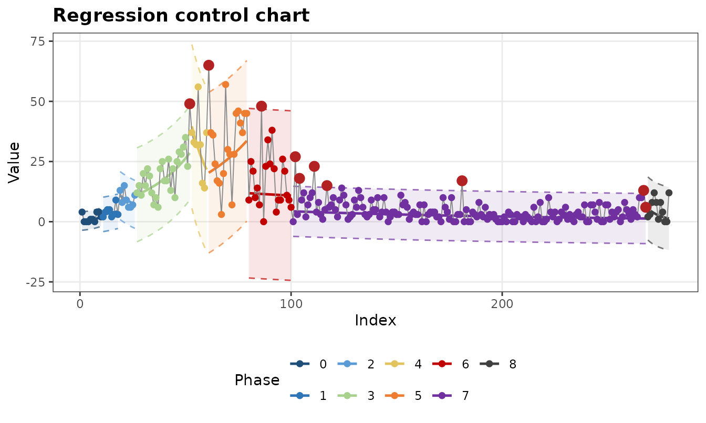

# Case study: epidemiological monitoring (COVID-19, Recife)

``` r

library(shewhartr)
library(ggplot2)
library(dplyr)
```

This case study reconstructs the use case that originally motivated the
package: monitoring daily COVID-19 mortality in Recife, capital of
Pernambuco state, Brazil, during 2020. The challenge is that epidemic
curves are *non-stationary by construction* — they grow, peak, and
recede. A classical Shewhart chart applied naively to the raw counts
would either miss the early acceleration or fire constant false alarms
during the descent.

The right tool is a regression-based control chart with automatic phase
detection: fit a model to the trend, place limits around the fit, and
let runs rules announce when the trend itself has changed.

## The data

`cvd_recife` is a tibble shipped with the package. (Run
`source("data-raw/build_all.R")` once if the dataset is not yet built
locally.)

``` r

data(cvd_recife)
head(cvd_recife)
#> # A tibble: 6 × 3
#>   date       new_deaths    .t
#>   <date>          <int> <int>
#> 1 2020-03-28          4     1
#> 2 2020-03-29          0     2
#> 3 2020-03-30          0     3
#> 4 2020-03-31          0     4
#> 5 2020-04-01          1     5
#> 6 2020-04-02          1     6
```

Columns: `date`, `new_deaths`, `.t` (an integer 1..N row index, useful
when a model needs a numeric predictor).

## A first attempt: classical I-MR

``` r

fit_imr <- shewhart_i_mr(cvd_recife,
                         value = new_deaths,
                         index = date)
broom::glance(fit_imr)
#> # A tibble: 1 × 8
#>   type      n phase   sigma_hat sigma_method n_violations n_rules pct_violations
#>   <chr> <int> <chr>       <dbl> <chr>               <int>   <int>          <dbl>
#> 1 i_mr    279 phase_1      5.17 mr                    139       2          0.498
```

The chart fires repeatedly along the entire ascending limb of the first
wave — every “violation” is the chart noticing that today is worse than
yesterday, which is true and is also exactly what we already knew. The
classical chart is the wrong tool: it reports violations of
stationarity, not violations of the underlying public health story.

## The right tool: regression chart with phase detection

``` r

fit <- shewhart_regression(
  cvd_recife,
  value      = new_deaths,
  index      = .t,
  model      = "loglog",
  phase_rule = "we_seven_same",   # legacy WE rule used in the original analysis
  rules      = c("nelson_1_beyond_3s", "we_seven_same")
)
broom::glance(fit)
#> # A tibble: 1 × 8
#>   type        n phase sigma_hat sigma_method n_violations n_rules pct_violations
#>   <chr>   <int> <chr>     <dbl> <chr>               <int>   <int>          <dbl>
#> 1 regres…   279 phas…      3.47 mr                     10       2         0.0358
length(fit$fits)        # number of phases
#> [1] 9
```

``` r

autoplot(fit)
```



What the chart now does:

- The centre line follows the fitted trend, period by period.
- Limits move with the centre line.
- Violations are points that depart from the *expected trajectory*, not
  just from a constant baseline.
- Phase changes mark candidate inflection points: places where the trend
  itself has shifted (a new wave, a containment measure taking effect, a
  vaccination campaign starting).

## Why log-log?

The `model = "loglog"` choice applies the transform
$`\log(\log(y/\alpha + 1) + 1)`$ to the response before fitting a linear
trend. This is more aggressive than `log` — it stabilises variance for
very right-skewed, heavy-tailed counts. For COVID mortality counts,
where day-to-day variability scales sharply with the level, the log-log
scale gave the cleanest residuals in the original analysis. Run
[`shewhart_box_cox()`](https://castlaboratory.github.io/shewhartr/reference/shewhart_box_cox.md)
on your own series to let the data choose:

``` r

shewhart_box_cox(cvd_recife$new_deaths + 1)$lambda_hat
#> [1] 0
```

If the maximiser is near 0, take logs. If it is near 0.5, the log-log
scale is a reasonable approximation. For values between 0 and 1, a
Box-Cox transformation in that range is the most defensible choice.

## Methodological caveats

A regression chart applied to time-series counts pushes against several
assumptions:

- **Independence.** Daily mortality counts are autocorrelated (the same
  person dying tomorrow versus today is rare; serially correlated
  under-reporting and reporting delays are common). Use
  [`shewhart_diagnostics()`](https://castlaboratory.github.io/shewhartr/reference/shewhart_diagnostics.md)
  to inspect the residual ACF; if the autocorrelation is strong,
  consider an ARIMA-based monitoring scheme instead (a topic for a
  future package release).
- **Right model.** A piecewise-linear log-scale fit is a heuristic. More
  principled epidemic-monitoring approaches use SEIR-type models, the
  renewal equation, or compartmental Bayesian filters (Cori et al. 2013;
  Flaxman et al. 2020). The package’s regression chart is best
  understood as a *signal-detection layer* on top of whatever
  forecasting model one uses.
- **Reporting heterogeneity.** Counts of “deaths today” usually reflect
  *reports* received today, not deaths occurring today. Lagged
  corrections produce sawtooth patterns that look like violations but
  are administrative.

## A note on the package’s history

The original v0.1 of `Shewhart` (now `shewhartr`) was built specifically
for this kind of analysis, in collaboration with the epidemiology team
monitoring COVID-19 in Recife. The transformation choices, the
7-points-in-a-row rule, and the start-base / phase-detection structure
were all calibrated for daily mortality counts. That heritage is
preserved here as one application among many, rather than as the
package’s organising principle. For everyday SPC, prefer the classical
chart families and the cleaner default rule (Nelson 2 — 9 points).

## References

- Cori, A., Ferguson, N. M., Fraser, C., & Cauchemez, S. (2013). A New
  Framework and Software to Estimate Time-Varying Reproduction Numbers
  During Epidemics. *American Journal of Epidemiology*, 178(9),
  1505-1512.
- Flaxman, S. et al. (2020). Estimating the Effects of
  Non-Pharmaceutical Interventions on COVID-19 in Europe. *Nature*, 584,
  257-261.
- Box, G. E. P., Jenkins, G. M., & Reinsel, G. C. (2008). *Time Series
  Analysis: Forecasting and Control* (4th ed.). Wiley.
- Mandel, B. J. (1969). The Regression Control Chart. *Journal of
  Quality Technology*, 1(1), 1-9.
