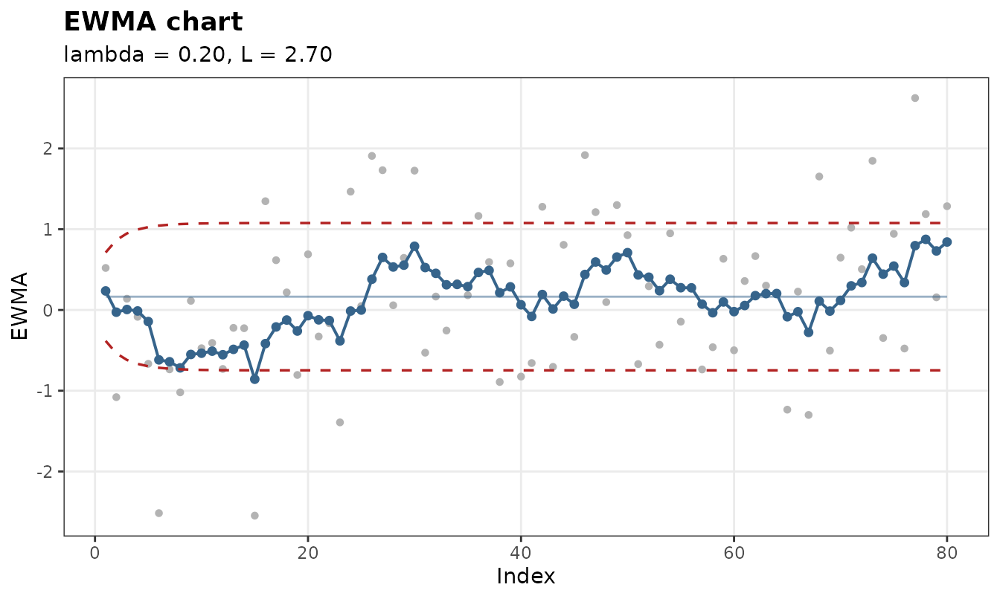
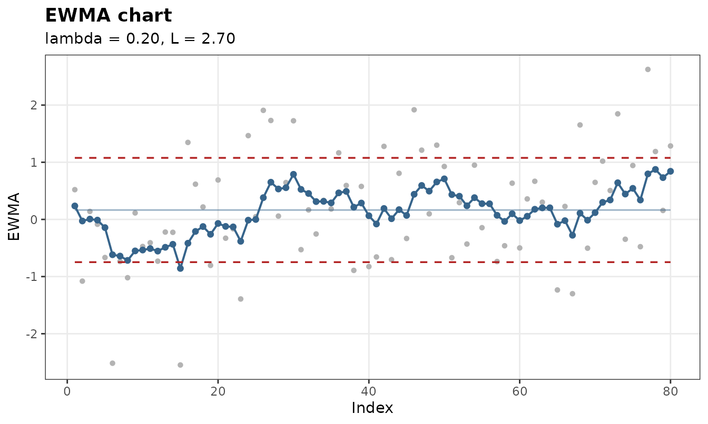
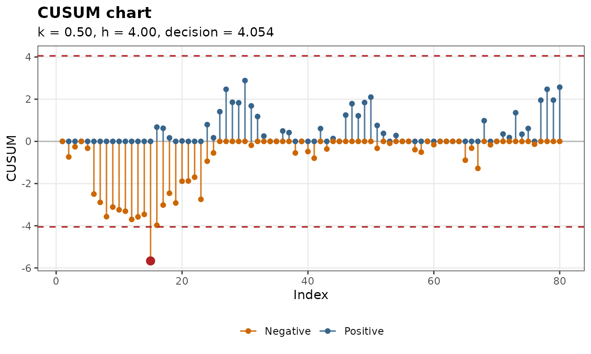
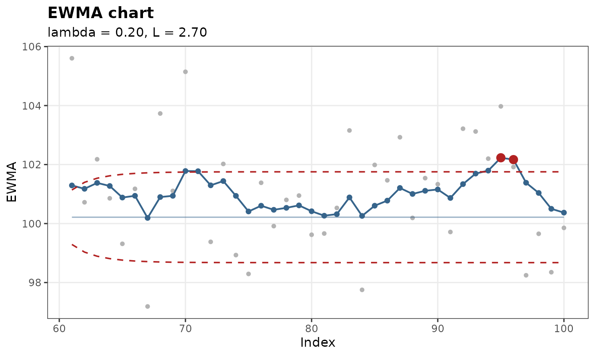

# Memory-based charts: EWMA and CUSUM

``` r

library(shewhartr)
library(ggplot2)
library(dplyr)
```

## When the Shewhart chart is too slow

A Shewhart chart looks at one observation at a time. Each point is
compared against the centre line and the 3-sigma limits, and that’s it —
the chart has *no memory* of what came before (the runs rules add a
little, but only a little). This makes Shewhart charts excellent at
catching **large** shifts the moment they happen, but fairly slow at
catching **small persistent** shifts that would only become visible
after the data has had time to drift.

EWMA and CUSUM accumulate information across observations, trading a
slightly less direct interpretation for substantially better sensitivity
to small shifts.

``` r

# A 0.5-sigma sustained shift after observation 40
set.seed(2026)
n      <- 80
shift  <- c(rnorm(40, mean = 0, sd = 1),
            rnorm(40, mean = 0.5, sd = 1))
df     <- tibble::tibble(t = seq_len(n), y = shift)

imr  <- shewhart_i_mr(df,  value = y, index = t)
ewma <- shewhart_ewma(df,  value = y, index = t)
cusum <- shewhart_cusum(df, value = y, index = t)

# Position of the first alarm under each chart
first_alarm <- function(fit) {
  hits <- which(fit$augmented$.flag_any)
  if (length(hits) == 0L) NA_integer_ else min(hits)
}
tibble::tibble(
  chart  = c("I-MR", "EWMA", "CUSUM"),
  alarm  = c(first_alarm(imr), first_alarm(ewma), first_alarm(cusum))
)
#> # A tibble: 3 × 2
#>   chart alarm
#>   <chr> <int>
#> 1 I-MR     10
#> 2 EWMA     NA
#> 3 CUSUM    15
```

For a 0.5-sigma shift, the I-MR chart often fails to signal at all
within 80 observations, while the EWMA and CUSUM typically catch it
within a few points of the change.

## EWMA — Exponentially Weighted Moving Average

The EWMA statistic is a recursive convex combination:
``` math
z_i = \lambda x_i + (1 - \lambda) z_{i-1}, \qquad z_0 = \mu.
```

With `lambda` close to 1 the chart behaves like a Shewhart I chart
(little memory). With `lambda` close to 0 it averages over a long
history (heavy memory, slow but very sensitive). The classical default
`lambda = 0.2`, `L = 2.7` gives `ARL_0 ≈ 370` and is well matched to
detecting shifts of 0.5 to 1 sigma (Lucas & Saccucci 1990).

``` r

fit <- shewhart_ewma(df, value = y, index = t,
                     lambda = 0.2, L = 2.7)
fit
#> 
#> ── Shewhart chart ewma ─────────────────────────────────────────────────────────
#> • Observations / subgroups: 80
#> • Phase: "phase_1"
#> • Sigma estimate ("mr"): 1.014
#> 
#> 
#> ── Control limits ──
#> # A tibble: 3 × 3
#>   chart line            value
#>   <chr> <chr>           <dbl>
#> 1 EWMA  CL              0.165
#> 2 EWMA  UCL_asymptotic  1.08 
#> 3 EWMA  LCL_asymptotic -0.748
#> ── Rule violations ──
#> 
#> ✔ No violations across 1 rule: "nelson_1_beyond_3s".
autoplot(fit)
```



The control limits in an EWMA chart are **time-varying** by default.
They start narrow and widen out to the asymptotic value
`L · σ · sqrt(λ / (2 - λ))` as the recursion warms up. This is the
correct probability-symmetric calibration; setting `steady_state = TRUE`
flattens them out at the asymptotic value (a common simplification once
you have a long enough baseline).

``` r

shewhart_ewma(df, value = y, index = t, steady_state = TRUE) |>
  autoplot()
```



### Choosing `lambda`

A practical guide (Montgomery 2019, Table 9.10):

| Target shift size | Reasonable `lambda` | `L`  | ARL_0 |
|-------------------|---------------------|------|-------|
| 0.25 σ            | 0.05                | 2.49 | ~370  |
| 0.50 σ            | 0.10                | 2.70 | ~370  |
| 0.75 σ            | 0.20                | 2.86 | ~370  |
| 1.00 σ            | 0.40                | 3.00 | ~370  |

Choose the *smallest* shift you care about, then use the matching row.
You can validate the actual ARL with
\[[`shewhart_arl()`](https://castlaboratory.github.io/shewhartr/reference/shewhart_arl.md)\]
from the arl-simulation vignette.

## CUSUM — Cumulative Sum

The tabular CUSUM keeps two non-negative running totals, one for upward
drift and one for downward drift:

``` math
C^+_i = \max\!\left(0,\; C^+_{i-1} + (x_i - \mu) - k\sigma\right)
```

``` math
C^-_i = \max\!\left(0,\; C^-_{i-1} - (x_i - \mu) - k\sigma\right)
```

An alarm fires when either crosses the **decision interval**
`h · sigma`. The reference value `k` is typically *half* the smallest
shift size the chart should be sensitive to (so `k = 0.5` for shifts of
`1·σ`); `h` controls the false-alarm rate.

``` r

fit <- shewhart_cusum(df, value = y, index = t, k = 0.5, h = 4)
fit
#> 
#> ── Shewhart chart cusum ────────────────────────────────────────────────────────
#> • Observations / subgroups: 80
#> • Phase: "phase_1"
#> • Sigma estimate ("mr"): 1.014
#> 
#> 
#> ── Control limits ──
#> # A tibble: 2 × 3
#>   chart line    value
#>   <chr> <chr>   <dbl>
#> 1 CUSUM h_upper  4.05
#> 2 CUSUM h_lower -4.05
#> ── Rule violations ──
#> 
#> ! 1 violation across 1 rule.
#> cusum_decision: 1 hit.
autoplot(fit)
```



The plot draws `C+` as positive bars (potential upward drift) and `C-`
as negative bars (potential downward drift), with the symmetric decision
interval in dashed red. CUSUM’s main charm is interpretability once it
signals: the bar’s height tells you how much accumulated deviation
triggered the alarm.

### Choosing `k` and `h`

Hawkins & Olwell (1998), Table 3.1, gives ARL profiles for `k = 0.5`
(the most common choice):

| `h`  | ARL_0 (in control) | ARL_1 at 1σ shift |
|------|--------------------|-------------------|
| 4.00 | ~168               | ~8.4              |
| 4.77 | ~370               | ~10.4             |
| 5.00 | ~465               | ~10.9             |

The default `h = 4` is appropriate for diagnostic monitoring. For a
production chart matched to the typical Shewhart `ARL_0 = 370`, raise
`h` to `4.77`.

## Phase II monitoring

Both charts accept `target` and `sigma` to override the in-data
estimates — exactly what you need for Phase II monitoring against a
clean Phase I baseline. The example below calibrates on a 60-point
in-control baseline and then monitors a fresh 40-point period:

``` r

set.seed(1)
baseline <- tibble::tibble(t = 1:60, y = rnorm(60, mean = 100, sd = 2))
mu_hat   <- mean(baseline$y)
sd_hat   <- sd(baseline$y)

new_data <- tibble::tibble(
  t = 61:100,
  y = rnorm(40, mean = 100.8, sd = 2)   # 0.4 sigma shift
)

shewhart_ewma(new_data, value = y, index = t,
              target = mu_hat, sigma = sd_hat,
              lambda = 0.2, L = 2.7) |>
  autoplot()
```



A
[`calibrate()`](https://castlaboratory.github.io/shewhartr/reference/calibrate.md)
/
[`monitor()`](https://castlaboratory.github.io/shewhartr/reference/monitor.md)
integration for memory-based charts is on the roadmap for a future
release; for the moment the explicit `target` / `sigma` arguments give
you the same workflow with one extra line.

## Which one should I use?

| Question | EWMA | CUSUM | Shewhart |
|----|----|----|----|
| Best at 0.25–1 σ shifts? | ✔ | ✔ |  |
| Best at \>2 σ shifts? |  |  | ✔ |
| Plot reads like the original variable? | ✔ |  | ✔ |
| Communicates *magnitude* of accumulated drift? |  | ✔ |  |
| Survives autocorrelated data well? | (with care) | (with care) |  |
| Pairs naturally with runs rules? | (Nelson 1 only) |  | ✔ |

Many practitioners run **both** a Shewhart chart and an EWMA (or CUSUM)
on the same series — the Shewhart catches large excursions, the
memory-based catches the slow drifts.

## References

- Roberts, S. W. (1959). Control Chart Tests Based on Geometric Moving
  Averages. *Technometrics*, 1(3), 239-250.
- Page, E. S. (1954). Continuous Inspection Schemes. *Biometrika*,
  41(1-2), 100-115.
- Lucas, J. M., & Saccucci, M. S. (1990). Exponentially Weighted Moving
  Average Control Schemes: Properties and Enhancements. *Technometrics*,
  32(1), 1-12.
- Hawkins, D. M., & Olwell, D. H. (1998). *Cumulative Sum Charts and
  Charting for Quality Improvement*. Springer.
- Montgomery, D. C. (2019). *Introduction to Statistical Quality
  Control* (8th ed.). Wiley. Chapter 9.
